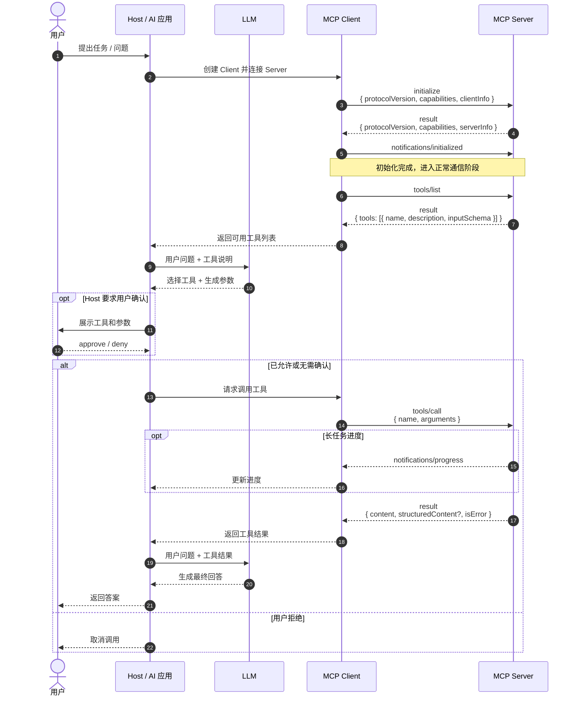

# MCP 简介与工具调用流程

MCP（Model Context Protocol，模型上下文协议）是一套让 AI 应用以统一方式连接外部能力的开放协议。它把文件、数据库、GitHub、IDE、企业系统等能力封装成标准接口，使不同 AI 应用可以按需发现、调用和组合这些能力。

可以把 MCP 理解为 AI 应用与外部系统之间的“通用插座”：AI 应用不必为每个系统单独设计一套接入方式，而是通过 MCP Client 与相应的 MCP Server 通信。


## 核心角色

MCP 采用 Host / Client / Server 架构。一个 Host 可以管理多个 Client；每个 Client 通常与一个 Server 维持一条相互隔离的连接。

| 角色 | 职责 | 示例 |
| --- | --- | --- |
| Host | 承载 AI 会话，管理上下文、权限、用户确认与 Client 生命周期，并将工具结果交给 LLM 使用 | Codex、Claude Code、Cursor、IDE、Agent 应用 |
| MCP Client | 由 Host 创建，负责与某个 Server 协商协议、收发消息和维护会话 | Host 内部的 MCP 连接实例 |
| MCP Server | 对外提供专一能力，执行真实操作并返回结果 | 文件系统、GitHub、数据库、IDE 索引服务 |
| LLM | 根据用户问题和 Host 提供的工具说明，决定是否调用工具以及如何组织答案 | GPT、Claude 等模型 |

关键边界是：**Host 管理会话、权限与用户授权；Server 只暴露自己负责的能力。** Server 不应默认获得完整对话历史，也不应直接访问其他 Server 的数据。

## Server 可以提供什么

MCP Server 常见的三类能力如下。

| 能力 | 用途 | 示例 |
| --- | --- | --- |
| Tools | 可执行的动作，由模型选择调用 | `query_db`、`search_code`、`run_tests` |
| Resources | 可读取的上下文数据 | 文件、日志、表结构、配置、Schema |
| Prompts | 可复用的提示模板或工作流入口 | `code_review`、`summarize_logs` |

其中，Tools 是最常见的能力。每个工具包含名称、说明和 `inputSchema`；Schema 用于约束工具参数，帮助 Host 和 LLM 正确构造调用。

## 一次工具调用如何发生

下面的流程以“用户让 AI 查询数据库”为例。MCP 消息以 JSON-RPC 为基础传输。



### 1. 初始化与能力协商

Client 先发送 `initialize`，声明支持的协议版本、Client 能力和实现信息；Server 返回自己支持的协议版本、能力和服务信息。随后 Client 发送 `notifications/initialized`，表示初始化完成。

只有双方声明并协商成功的能力，才能在本次会话中使用。例如，Server 只有声明 `tools` 能力后，Client 才能调用 `tools/list` 和 `tools/call`。

### 2. 发现可用工具

Client 通过 `tools/list` 获取工具清单。工具定义通常包括：

```json
{
  "name": "query_db",
  "description": "查询只读业务数据库",
  "inputSchema": {
    "type": "object",
    "properties": {
      "sql": { "type": "string" }
    },
    "required": ["sql"]
  }
}
```

Host 将工具说明提供给 LLM。LLM 负责把“查一下今天的订单数”这类自然语言需求转换为工具名和结构化参数；它不会直接连接数据库。

### 3. 调用工具并使用结果

Host 把 LLM 的选择交给 Client，Client 发送 `tools/call`：

```json
{
  "name": "query_db",
  "arguments": {
    "sql": "SELECT COUNT(*) AS order_count FROM orders WHERE created_at >= CURRENT_DATE"
  }
}
```

Server 执行操作并返回 `content`，也可以同时返回适合程序处理的 `structuredContent`。对于耗时任务，Server 可通过 `notifications/progress` 报告进度。Host 再将结果交给 LLM，由 LLM 解释结果并回复用户。

## 权限与安全

MCP 解决的是“标准化连接”，不等于自动获得安全保障。实践中应把安全边界放在 Host 和 Server 两端：

- Host 应向用户清晰展示正在使用的工具；对写入、删除、执行命令、发送消息等高风险操作进行确认。
- Server 应按最小权限运行，例如数据库 Server 使用只读账号，文件系统 Server 限制可访问目录。
- 工具参数和工具返回内容都应视为不可信输入；避免把敏感数据、提示注入内容或未经验证的命令直接传递到下游系统。
- 为调用设置超时、审计日志和可撤销机制，避免故障或误操作无限扩大影响。

需要注意：用户确认属于 Host 的交互与安全策略，MCP 协议本身不规定必须采用哪一种确认界面；但官方规范建议为工具调用保留人工拒绝的能力。

## 工具列表变化与连接结束

Server 如果在能力协商中声明了 `tools.listChanged`，工具列表发生变化时可以发送 `notifications/tools/list_changed`。Client 随后重新调用 `tools/list`，让 Host 获得最新能力。

会话结束时，通常由 Client 关闭底层连接或子进程。MCP 没有定义独立的 `close` 协议消息：`stdio` 传输通过关闭子进程输入和进程退出结束，HTTP 传输通过关闭相关连接结束。

## 小结

MCP 的价值不在于替代 LLM，而在于把 AI 应用与外部工具、数据和工作流解耦：

1. Server 以统一协议暴露能力。
2. Host 负责连接、权限、会话和上下文编排。
3. LLM 根据任务选择工具，并把结果组织为用户可理解的回答。

这种分工使一个 AI 应用能够组合多个独立 Server，同时保留清晰的权限边界和可控的工具调用过程。

## 参考资料

- [MCP 架构说明](https://modelcontextprotocol.io/specification/2025-11-25/architecture)
- [MCP 连接生命周期](https://modelcontextprotocol.io/specification/2025-11-25/basic/lifecycle)
- [MCP Tools 规范](https://modelcontextprotocol.io/specification/2025-11-25/server/tools)
