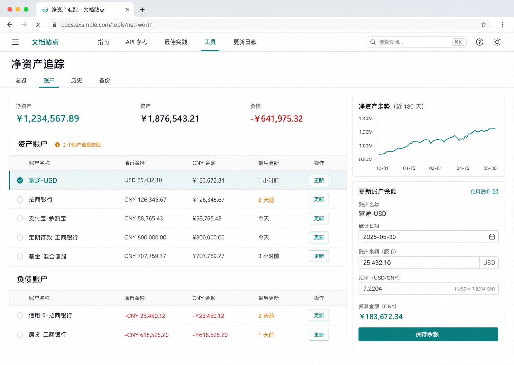
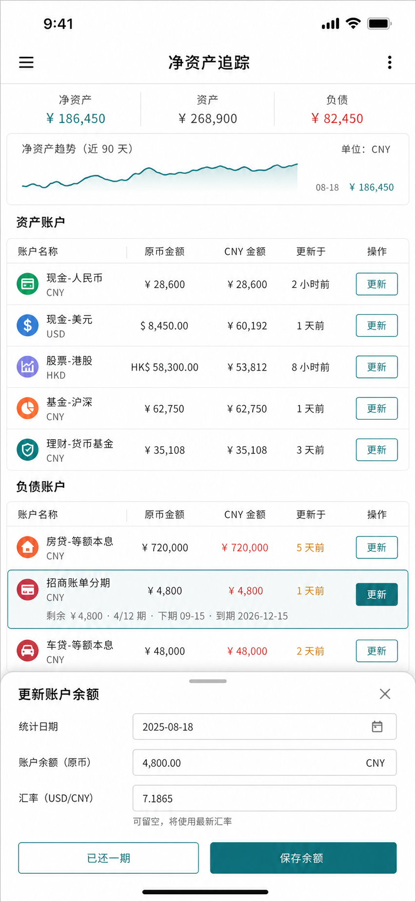

# 个人净资产追踪器视觉设计 Brief

## 已选方向

采用方案 B：账户列表是主工作区，用户选中账户后直接在右侧更新日期、余额与汇率。顶部摘要和趋势图用于判断，不抢占账户操作的视觉优先级。

该图片是视觉方向探针，不是最终像素规格；其中的金额均为虚构示例。

手机稿保留账户列表的主地位，使用底部面板承载更新余额和“已还一期”，不引入悬浮操作按钮。

## 视觉语言

- **色彩策略**：克制。沿用 VitePress 青绿色品牌变量，搭配白色与冷灰中性色。
- **使用场景**：用户在手机或电脑上快速核对个人账户，状态专注且对金额准确性敏感；默认明亮主题，暗色跟随站点。
- **参考锚点**：当前 VitePress 站点的品牌连续性、Linear 的克制状态表达、Actual Budget 的账目清晰度。
- **反方向**：营销首页、巨大指标数字、海军蓝与金色金融风、终端风、玻璃拟态、渐变和重复卡片墙。

## 版式

- 顶部使用一条紧凑汇总栏展示净资产、资产和负债。
- 桌面主区约 `68% / 32%`：左侧为资产和负债账户列表，右侧为趋势图及选中账户编辑区。
- 手机端改为单列账户列表；选中账户后从底部打开编辑面板，趋势图缩为简洁折线。
- 分期负债在一行内显示剩余金额、剩余期数、下次还款日和最终到期日；“已还一期”是明确操作，不与普通更新按钮混淆。

## 状态与颜色

- 青绿色：当前选中、主要按钮、键盘焦点和成功保存。
- 红色：负债金额、校验错误、删除和覆盖等危险操作。
- 橙色：数据较旧、待确认还款和分期逾期。
- 中性灰：停用账户、辅助时间和解释文字。
- 所有正文达到 WCAG AA 对比度；不能只依赖颜色表达状态。

## 组件状态

| 组件     | 默认                                 | 选中/进行中                        | 错误或风险                             | 完成                   |
|----------|--------------------------------------|------------------------------------|----------------------------------------|------------------------|
| 账户行   | 显示原币余额、CNY 金额、最后更新时间 | 浅青背景，右侧编辑面板同步当前账户 | 数据较旧显示时间和文字提示             | 保存后更新时间立即刷新 |
| 余额编辑 | 日期、金额、汇率可编辑               | 保存按钮获得焦点，自动汇率显示来源 | 汇率失败保留输入并要求确认回退值       | 显示“已保存”短提示     |
| 分期负债 | 显示剩余金额、期数、下期和到期日     | “已还一期”与普通保存并列但语义不同 | 待确认还款用橙色，过期用橙色文字加图标 | 期数为零时显示“已结清” |
| 覆盖操作 | 显示本地与远程时间                   | 确认按钮明确写出覆盖方向           | 预览失败不改变当前账本                 | 覆盖后显示回退可用     |

## 内容和交互约束

- 主要按钮使用动词加对象，例如“保存余额”“备份到 OneDrive”“从 OneDrive 同步”。
- 账户列表是页面入口，空账本直接提供“新增第一个账户”，不使用无意义的空白插画。
- 桌面右侧编辑面板和手机底部面板共用相同字段、校验和文案。
- 分期账户的“已还一期”必须显示实际还款日期，不能仅按计划日期执行。
- 所有覆盖、停用、删除和历史修正操作在确认文案中写明影响范围。

## 高保真设计稿交付范围

- 桌面总览与账户快速更新。
- 手机总览与底部账户编辑面板。
- 新增普通账户和新增分期负债。
- 空账本、汇率失败、数据较旧、待确认还款、分期逾期和已结清。
- 本地上传覆盖与 OneDrive 同步确认。
- 明暗主题的颜色、字体、间距、按钮、输入框、列表行、图表和状态规格。
