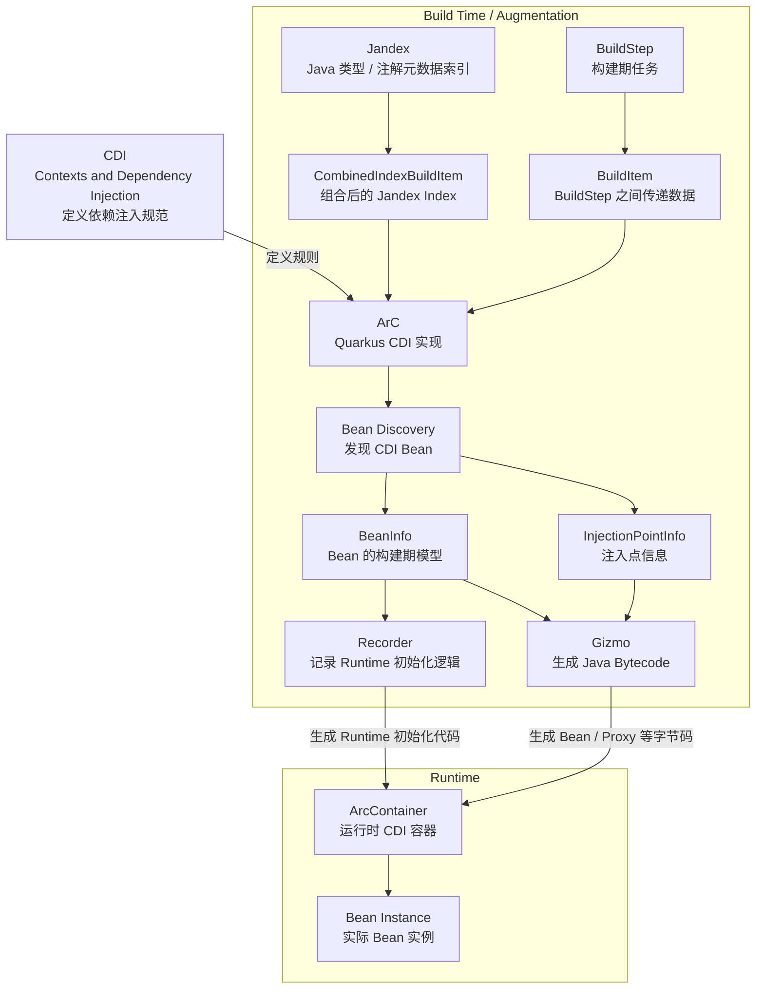

https://quarkus.io/guides/  官网 源码  https://github.com/quarkusio/quarkus

## 简介

Quarkus 不是“另一个 Spring Boot”。它的核心区别在于尽可能把运行时工作提前到 build time。

## SpringBoot 对比

### 源码/组件对比

| Spring Boot 思维        | Quarkus 思维                                     |
|-------------------------|--------------------------------------------------|
| Runtime Framework       | **Build Time 优先的 Framework**                  |
| ApplicationContext      | CDI / ArC                                        |
| Bean 大量在启动时解析   | **大量工作在构建期完成**                         |
| `@Component/@Service`   | `@ApplicationScoped` 等 CDI Scope                |
| `@Autowired`            | `@Inject` / Constructor Injection                |
| `@Bean`                 | `@Produces`                                      |
| Spring MVC              | Jakarta REST / Quarkus REST                      |
| Spring Data JPA         | Hibernate ORM + Panache                          |
| `application.yml`       | SmallRye Config                                  |
| `@SpringBootTest`       | `@QuarkusTest`                                   |
| Testcontainers 自己配置 | **Dev Services 自动管理**                        |
| WebFlux `Mono/Flux`     | Mutiny `Uni/Multi`                               |
| Actuator                | SmallRye Health / Micrometer 等                  |
| Spring Security         | Quarkus Security / OIDC                          |
| Spring Native/AOT       | Quarkus Build-time Augmentation + GraalVM Native |

### 概念对比

| Quarkus           | Spring 中可以类比的概念                    | 核心区别                           |
|-------------------|--------------------------------------------|------------------------------------|
| CDI               | Spring DI 编程模型                         | CDI 是 Jakarta 标准                |
| ArC               | BeanFactory / ApplicationContext           | ArC 大量工作在 Build Time          |
| Jandex            | ASM / MetadataReader / Reflection          | Jandex 是预先建立的类型索引        |
| BeanInfo          | BeanDefinition                             | ArC 内部 Bean 模型                 |
| BuildStep         | Spring Framework 启动阶段 Processor 的工作 | Quarkus 在 Build 阶段执行          |
| BuildItem         | Processor 间的数据/状态                    | Quarkus 明确建立 DAG               |
| Augmentation      | Spring Boot 启动时自动配置、扫描等过程     | Quarkus 把大量工作提前到 Build     |
| Recorder          | 无完全等价概念                             | Build Time 记录 Runtime 初始化逻辑 |
| Gizmo             | ASM / ByteBuddy 等                         | Quarkus 字节码生成工具             |
| Synthetic Bean    | 程序化 BeanDefinition                      | Build Time 注册                    |
| deployment module | Spring Framework 内部 Processor 类似职责   | 不进入最终普通 Runtime             |
| runtime module    | Spring 应用运行时组件                      | 真正参与应用运行                   |

